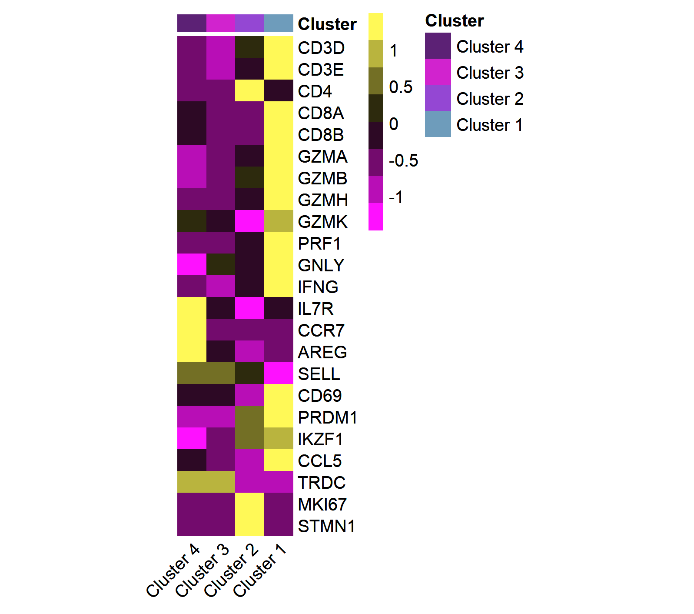
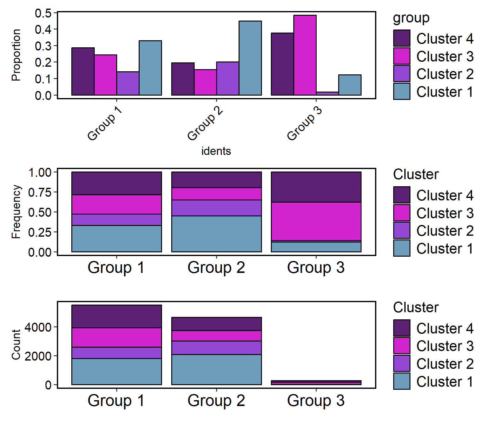
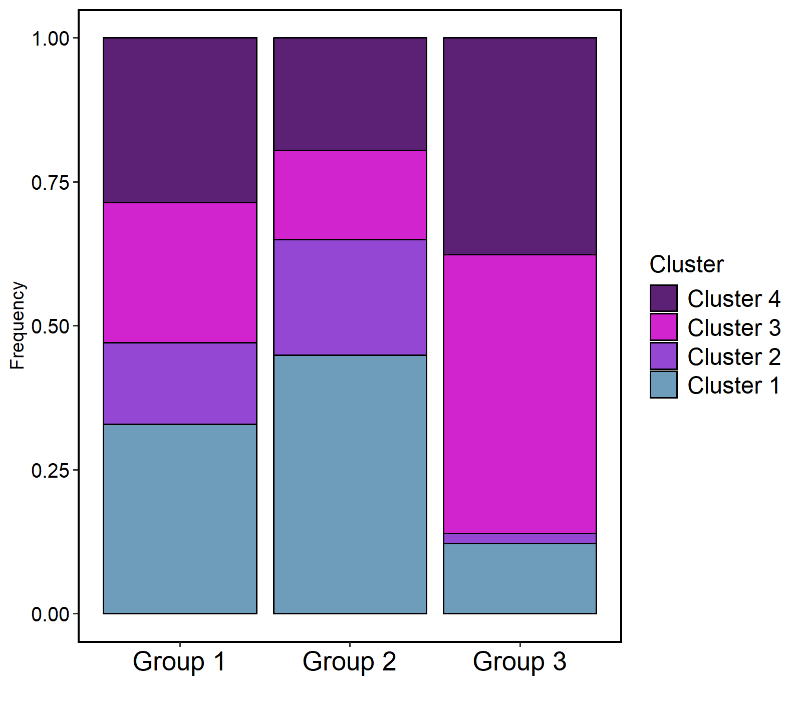
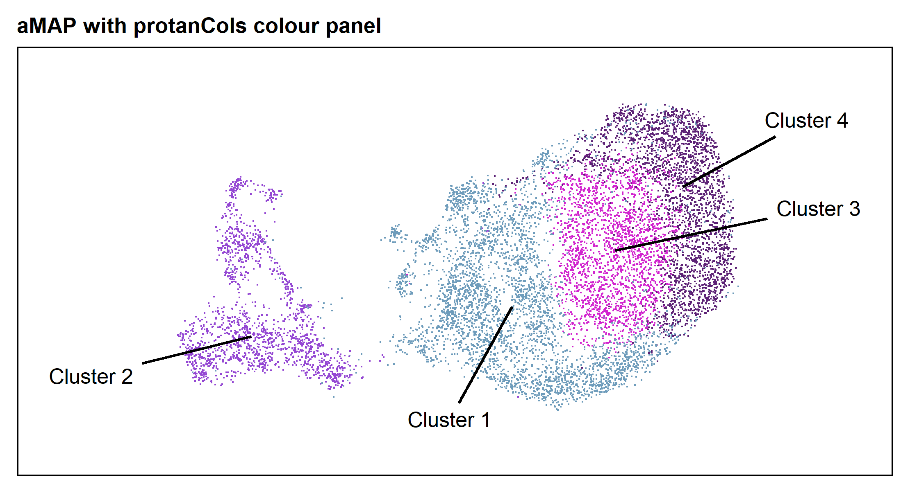
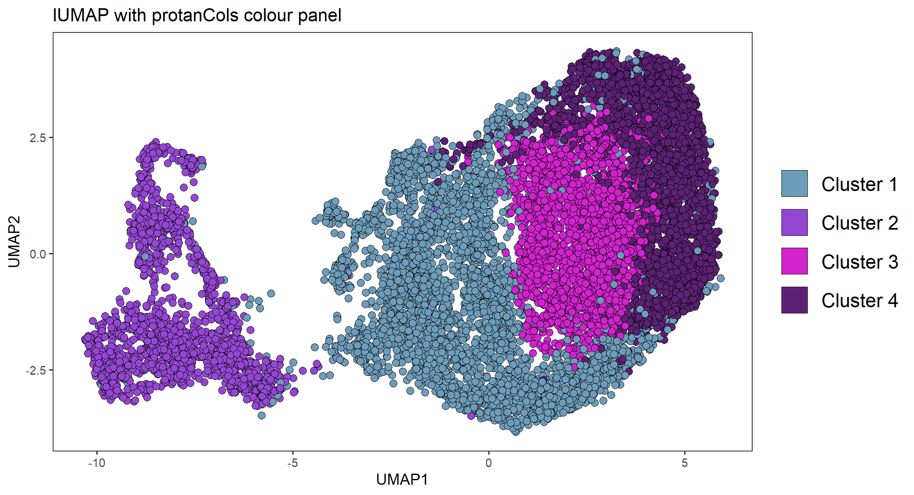
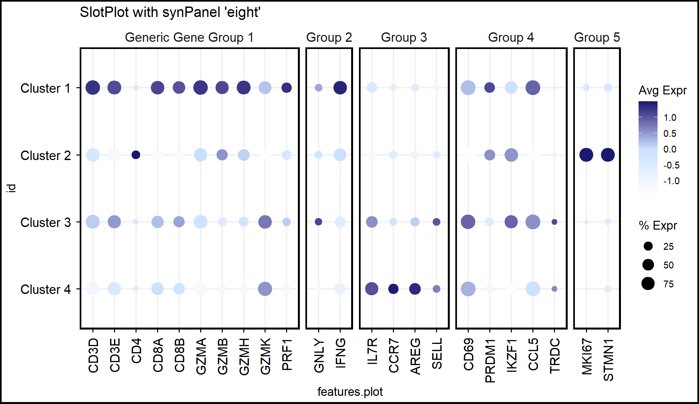

## luktils (luke-tils, like Luke Utils) is a package made to make my life easier. 
Yes that's how you say it. It seemed like a good idea at the time.

There's no guarantee it'll make your life easier. 

Or mine, for that matter. 

scRNA-seq analysis, plotting, and dataviz.

And it doesn't even do that particularly well.

## Current Functions:
### / [subToMain](R/subToMain.R) \\
This is a quick function to move the active idents from an object subclustered new labels to a larger object by matching cell names.

### / [topX](R/topX.R) \\
A short function to get the top log2FC X genes per cluster from a FindAllMarkers readout, for example, to help plotting of marker genes.

### / [avgHeatmap](R/avgHeatmap.R) \\
This is a heatmap plotting that uses pheatmap and AggregateExpression to make averaged expression heatmaps per cluster, instead of the default DoHeatmap which has each cell plotted as it's own line. This uses the same heatmap colours as default Seurat plotting for clarity, colours specify the clustering bar along the top of the heatmap.

The following plot can be made by running:
> p <- avgHeatmap(data, features = synPanel("eight"), cols = protanCols(2))

### / [freqCharts](R/freqCharts.R) \\
This makes 3 charts which show one metadata against another, both in raw numbers and in frequency (scaled from 0-1) to show, for example, abundance of clusters per experimental group.

The following plot can be made by running:
> p <- freqCharts(data, cols = rev(protanCols(2)))

and you can zoom on a single aspect of the 3 charts by running (for example to select the second one)
> p[[2]]

### / [aMAP](R/aMAP.R) \\
aMAP (Annotated UMAP) builds on Seurat's DimPlot to instead draw lines to annotate clusters, resulting in a cleaner UMAP without overlayed cluster names.

The following plot can be made by running: (noting that your extensions and text offsets will vary)
> p <- aMAP(data, default_ext = 3, per_exts = c("Cluster 2" = 3.25,
                                              "Cluster 3" = 4.5),
          per_text_offsets = c("Cluster 2" = 1.5,
                               "Cluster 3" = 1.5,
                               "Cluster 4" = 1), cols = protanCols(2)) + ggtitle("aMAP with protanCols colour panel")

### / [lUMAP](R/lUMAP.R) \\
lUMAP (El-UMAP or Loo-MAP, as in "Luke UMAP") uses a previously generated UMAP graph but changes the plot size, point circling, larger legend, and plot boxed in.

The following plot can be made by running:
> p <- luktils::lUMAP(data, cols = protanCols(2)) + ggtitle("lUMAP with protanCols colour panel")

### / [SlotPlot](R/LotPlot.R) \\
Edited Seurat::DotPlot to split the plot into groups of genes for better visual clarity.

The following plot can be made by running:
> p <- SlotPlot(data, gene_groups = list("Generic Gene Group 1" = 1:10,
                                       "Group 2" = 11:12,
                                       "Group 3" = 13:16,
                                       "Group 4" = 17:21,
                                       "Group 5" = 22:length(synPanel("eight"))),
              features = c(synPanel("eight"))) + ggtitle("SlotPlot with synPanel 'eight'")

### / [LimPlot](R/LimPlot.R) \\
LimPlot fixes Seurat's DimPlot, which by default requires you specify label = T, label.box = T, repel = T and +NoLegend(). LimPlot has all of these by default, saving literally 10s of seconds.

### / [protanCols](R/protanCols.R) \\
Colourblind-friendly colours for plotting. Currently only 3 panels but more to be added. (Panel 2 was used in the included examplar figures).

### / [synPanel](R/synPanel.R) \\
Helpful lists of common genes for clustering synovial scRNA-seq data. 

### / [FindNeighbours](R/FindNeighbours.R) \\
Fixes Seurat's "FindNeighbors", which is spelled incorrectly (masks Seurat::FindNeighbors but with British English Spelling)
